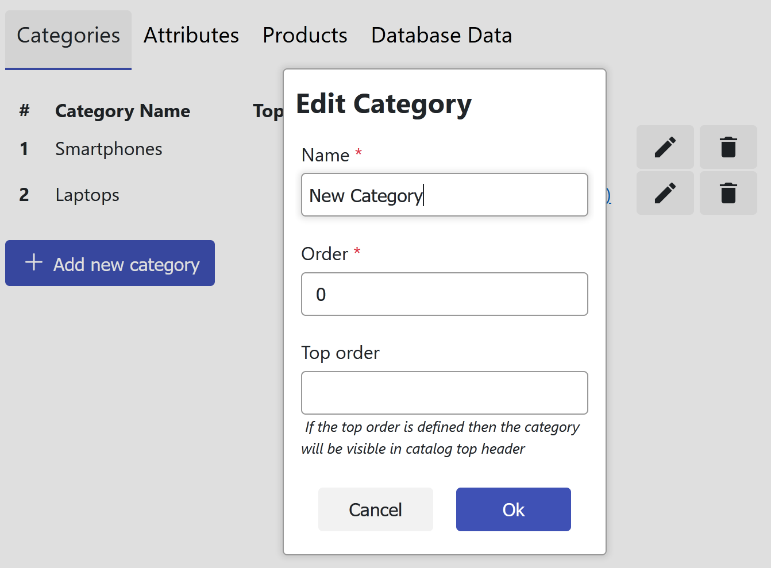
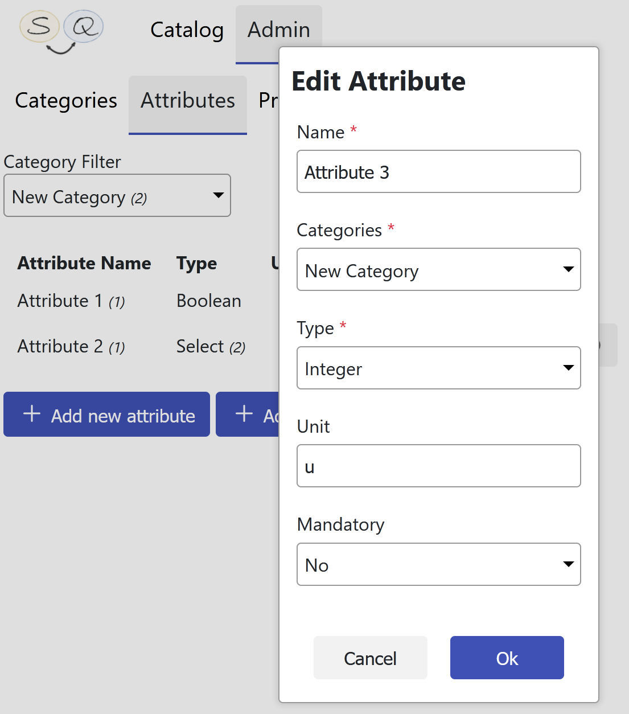
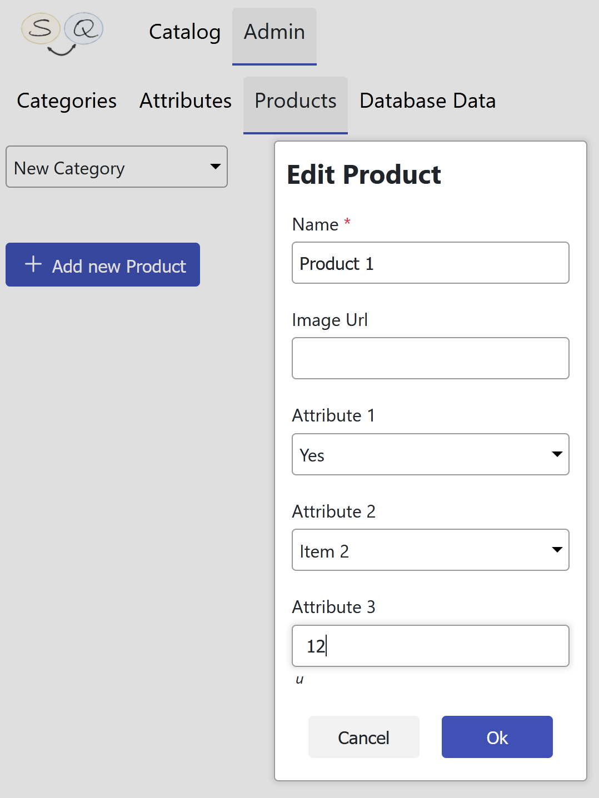
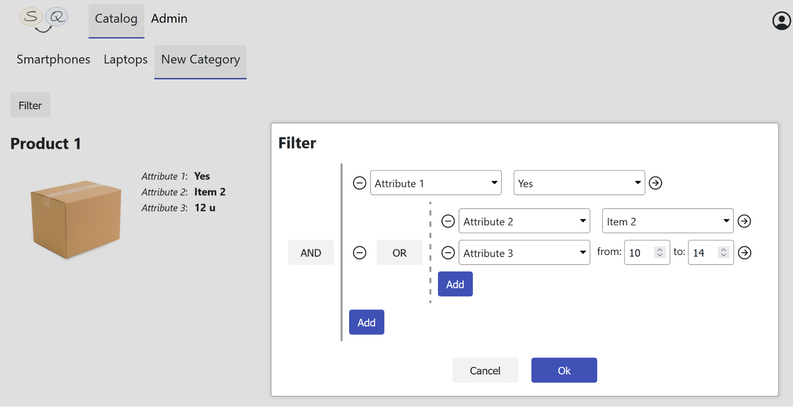
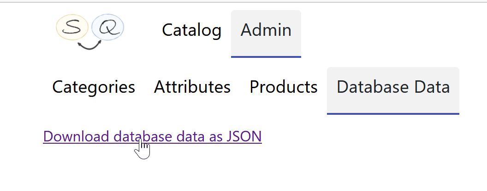

# SqGoods
It is a demo web application that demonstrates abilities of [SqExpress](https://github.com/0x1000000/SqExpress) and [ngSetState](https://github.com/0x1000000/ngSetState) libraries.

SqGoods it is a catalog of products with dynamic attributes. 

The key feature is a complex filtering (any kind of boolean expressions) using the dynamic attributes. 

## Prerequisites
- [.Net 5 SDK](https://dotnet.microsoft.com/en-us/download/dotnet/5.0)
- NodeJS
- MSSQL or MYSQL or PostgreSQL server (you will need to create an empty database)
## Configuration
In ```<Code Root>/SqGoods/appsettings.json``` update the following attributes

- **DbType** - ```MsSql``` or ```MySql``` or ```PgSql```
- **ConnectionString** - proper connection string to a selected server and the empty database

*All required tables and initial data will be created at the first run.*
## Running
1. go to  ```<Code Root>/SqGoods```
2. run ```dotnet run```
3. Open ```http://localhost:55242``` in a browser  

## What the Application does
SqGoods is a catalog of products divided into different categories with their own attributes.

- The administrator can add/remove both the categories themselves and their attributes:



- An attribute can be one of the following types:
  - Boolean
  - Integer
  - One of predefined attribute items (single select)
  - Subset of predefined attribute items (multi select)



- Also, administrator can add/remove/modify products in a selected category using the category attributes:



- Any user can see products grouped by categories and create a complex query:



- All database data can be exported into a JSON file:


